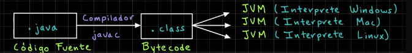

# Universidad Java - Cero a Experto (+150 Horas) ☕

## Introducción a Java

# ¿Por qué Aprender Java al día de hoy?

Java, lanzado por primera vez en 1995 creado originalmente por James Gosling en Sun Microsystems (ahora propiedad de Oracle), y ha sido un pilar en el mundo de la programación durante tres décadas. A pesar de la evolución constante de las tecnologías, Java sigue siendo uno de los lenguajes más demandados y utilizados en la industria. Aquí te explicamos por qué aprender Java es una decisión crucial para tu carrera en el desarrollo de software:

#### 1. Amplitud y Diversidad de Aplicaciones

Java es omnipresente. Se utiliza en una variedad de dominios, incluyendo:
-  **Desarrollo Web:** Con Frameworks como Spring y Hibernate, Java es fundamental para aplicaciones web robustas y escalables.
- **Aplicaciones Móviles:** Android, el sistema operativo móvil más popular del mundo, utiliza Java como uno de sus principales lenguajes de programación.
- **Sistemas Empresariales:** Muchas grandes corporaciones confían en Java para sus aplicaciones backend debido a su capacidad de manejo de grandes volúmenes de transacciones y datos.
- **Desarrollo Científico y Financiero:** Gracias a su robustez y rendimiento, Java es una opción preferida para aplicaciones científicas y financieras.

#### 2. Portabilidad y Plataformas Independiente

Una de las mayores fortalezas de Java es su lema "Escribe una vez, ejecuta en cualquier lugar" (WORA). Esto significa que el código Java compilado puede ejecutarse en cualquier plataforma que tenga una Máquina Virtual de Java (**JVM**). Esta portabilidad es crucial en un mundo donde los sistemas operativos y dispositivos son variados.

> [!NOTE]
> **WORA** significa escribir una vez, ejecutar en cualquier lugar.

#### 3. Seguridad y Rendimiento

Java fue diseñado con la seguridad en mente. Su arquitectura incluye características de seguridad incorporadas que protegen contra una amplia gama de amenazas y vulnerabilidades. Además, la gestión automática de memoria mediante Garbage Collection y su arquitectura multihilo lo hacen eficiente y rápido.

> [!NOTE]
> **Multihilo:** (multithreading) permite a las unidades centrales de procesamiento (CPU) aumentar el rendimiento del núcleo de un procesador sin necesidad de alterar la frecuencia.

#### 4. Comunidad y Ecosistema

Java cuenta con una de las comunidades de desarrolladores más grandes y activas del mundo. Esto significa que hay una vasta cantidad de recursos, bibliotecas, frameworks y herramientas disponibles para facilitar el desarrollo y la solución de problemas. Algunos de los recursos más destacados incluyen:
- **Spring Framework:** Para el desarrollo de aplicaciones web y microservicios.
- **Apache Maven y Gradle:** Para la gestión de proyectos y dependencias.
- **Intellij IDEA y Eclipse:** IDEs poderosos que ofrecen soporte robusto para el desarrollo en Java

#### 5. Oportunidades Profesionales

El mercado laboral para desarrolladores Java sigue siendo fuerte y está en crecimiento. Empresa de todo el mundo buscan desarrolladores Java para roles en diversos sectores. Además, aprender Java te proporciona una base sólida que facilita el aprendizaje de otros lenguajes y tecnologías.

#### 6. Innovaciones y Futuro

Java no ha dejado de evolucionar. Con versiones nuevas lanzadas regularmente, Java sigue mejorando en rendimiento, seguridad y funcionalidad. Características como las expresiones lambda y las API de Stream, introducidas en Java 8, y las más recientes mejoras en las últimas versiones de Java, muestran el compromiso continuo con la innovación.

#### Conclusión en Introducción

Java no es solo un lenguaje de programación; es una plataforma versátil y potente que ha resistido la prueba del tiempo. Aprender Java al día de hoy no solo te abrirá puertas a numerosas oportunidades profesionales, sino que también te equipará con las habilidades necesarias para abordar una amplia gama de desafíos tecnológicos.

### ¿Qué es JDK?

El JDK es fundamental para comenzar a programar en Java, ya que incluye todas las herramientas necesarias para compilar, ejecutar y depurar aplicaciones Java.

#### Pasos para Ejecutar un Programa en Java:

1. **Instalar el JDK:** Necesitas el JDK para compilar y ejecutar programas Java.
2. **Configurar un IDE o Editor:** Un buen entorno de desarrollo hace que escribir y depurar código sea más fácil, como Intellij IDEA o Apache Netbeans.
3. **Escribir el Código:** Escribe tu programa en un archivo .java
4. **Compilar el Código:** Usa el comando `javac` para compilar el archivo.
5. **Ejecutar el Programa:** Usa el comando `java` para ejecutar el programa compilado.

#### Datos Importantes

- **El JDK** incluye todas las herramientas necesarias para desarrollar y ejecutar programas Java.
- **Un IDE** como IntelliJ IDEA, Apache Netbeans o Eclipse proporciona herramientas adicionales para facilitar el desarrollo.
- **Compilar y Ejecutar:** Estos son los dos pasos clave para transformar tu código en una aplicación en funcionamiento

#### ¿Qué es un Compilador y por qué se necesita para trabajar con Java?

Un compilador es una herramienta que traduce el código fuente escrito por los programadores en un lenguaje de alto nivel (como Java) a un lenguaje de bajo nivel o código máquina que puede ser ejecutado directamente por el sistema operativo del computador. Este proceso es crucial porque las computadoras no entienden el código de alto nivel directamente; necesitan instrucciones en un formato que puedan ejecutar.

#### Por qué se Necesita un Compilador en Java

En el caso de Java, el compilador (llamando `javac`) convierte el código fuente java (.java) en bytecode (.class). El bytecode es un formato intermedio que es independiente de la plataforma y puede ser ejecutado en cualquier sistema operativo que tenga una Máquina Virtual Java (JVM).

#### ¿Qué es el JDK?

El **Java Development Kit (JDK)** es un paquete de herramientas necesarias para desarrollar aplicaciones en Java. Incluye:

1. **Compilador(`javac`):** Traduce el código fuente Java a bytecode.
2. **Java Runtime Environment (JRE):** Proporciona las bibliotecas y la JVM necesarias para ejecutar el bytecode.
3. **Herramientas de Desarrollo:** Incluye herramientas como el depurador (`jdb`), el empaquetador (`jar`), entra otras.

#### ¿Qué es el JRE?

El **Java Runtime Environment (JRE)** es un subconjunto del JDK. Es todo lo que necesitas para ejecutar programas Java, pero no para desarrollarlo. Incluye:

1. **JVM (Java Virtual Machine):** Ejecuta el bytecode Java.
2. **Bibliotecas de Clase:** Conjunto de bibliotecas necesarias para ejecutar aplicaciones Java.
3. **Otros Componentes:** Archivos de configuración, bibliotecas nativas, etc.

#### Relación entre JDK y JRE

- **JDK:** Incluye el JRE más las herramientas de desarrollo necesarias (como el compilador).
- **JRE:** Incluye solamente lo necesario para ejecutar aplicaciones Java.

#### Instalación del JDK y JRE

Cuando instalas el JDK, también obtienes el JRE como parte del paquete. Esto significa que al instalar el JDK, tendrás todas las herramientas necesarias tanto para desarrollar como para ejecutar programas Java.

#### Resumen

1. **Compilador:** Convierte el código fuente Java en bytecode que puede ser ejecutado por la JVM.
2. **JDK:** Incluye el compilador, el JRE, y otras herramientas de desarrollo.
3. **JRE:** Incluye la JVM y las bibliotecas necesarias para ejecutar aplicaciones Java.
4. **JVM:** Ejecuta el bytecode Java y permite la independencia de plataforma.

El intérprete JIT es una pieza clave en la JVM que permite a las aplicaciones Java ejecutar de manera eficiente y optimizada en tiempo de ejecución. Mediante la conversión dinámica de bytecode a código máquina nativo, el JIT mejora significativamente el rendimiento de las aplicaciones Java mientras mantiene la portabilidad y flexibilidad del lenguaje.

#### Conclusión

Entender el papel del compilador, el JDK, y el JRE es fundamental para trabajar con Java. Estas herramientas aseguran que puedes desarrollar y ejecutar aplicaciones Java en cualquier entorno, lo que hace de Java una opción poderosa y flexible para los desarrolladores.
