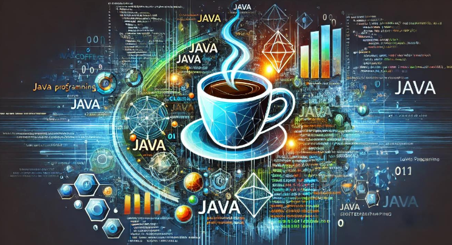
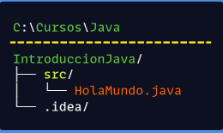
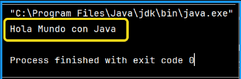

# Universidad Java - Cero a Experto (+150 Horas) ☕

## Introducción a Java



# ¿Por qué Aprender Java al día de hoy?

Java, lanzado por primera vez en 1995 creado originalmente por James Gosling en Sun Microsystems (ahora propiedad de Oracle), y ha sido un pilar en el mundo de la programación durante tres décadas. A pesar de la evolución constante de las tecnologías, Java sigue siendo uno de los lenguajes más demandados y utilizados en la industria. Aquí te explicamos por qué aprender Java es una decisión crucial para tu carrera en el desarrollo de software:

#### 1. Amplitud y Diversidad de Aplicaciones

Java es omnipresente. Se utiliza en una variedad de dominios, incluyendo:
-  **Desarrollo Web:** Con Frameworks como Spring y Hibernate, Java es fundamental para aplicaciones web robustas y escalables.
- **Aplicaciones Móviles:** Android, el sistema operativo móvil más popular del mundo, utiliza Java como uno de sus principales lenguajes de programación.
- **Sistemas Empresariales:** Muchas grandes corporaciones confían en Java para sus aplicaciones backend debido a su capacidad de manejo de grandes volúmenes de transacciones y datos.
- **Desarrollo Científico y Financiero:** Gracias a su robustez y rendimiento, Java es una opción preferida para aplicaciones científicas y financieras.

#### 2. Portabilidad y Plataformas Independiente

Una de las mayores fortalezas de Java es su lema "Escribe una vez, ejecuta en cualquier lugar" (WORA). Esto significa que el código Java compilado puede ejecutarse en cualquier plataforma que tenga una Máquina Virtual de Java (**JVM**). Esta portabilidad es crucial en un mundo donde los sistemas operativos y dispositivos son variados.

> [!NOTE]
> **WORA** significa escribir una vez, ejecutar en cualquier lugar.

#### 3. Seguridad y Rendimiento

Java fue diseñado con la seguridad en mente. Su arquitectura incluye características de seguridad incorporadas que protegen contra una amplia gama de amenazas y vulnerabilidades. Además, la gestión automática de memoria mediante Garbage Collection y su arquitectura multihilo lo hacen eficiente y rápido.

> [!NOTE]
> **Multihilo:** (multithreading) permite a las unidades centrales de procesamiento (CPU) aumentar el rendimiento del núcleo de un procesador sin necesidad de alterar la frecuencia.

#### 4. Comunidad y Ecosistema

Java cuenta con una de las comunidades de desarrolladores más grandes y activas del mundo. Esto significa que hay una vasta cantidad de recursos, bibliotecas, frameworks y herramientas disponibles para facilitar el desarrollo y la solución de problemas. Algunos de los recursos más destacados incluyen:
- **Spring Framework:** Para el desarrollo de aplicaciones web y microservicios.
- **Apache Maven y Gradle:** Para la gestión de proyectos y dependencias.
- **Intellij IDEA y Eclipse:** IDEs poderosos que ofrecen soporte robusto para el desarrollo en Java

#### 5. Oportunidades Profesionales

El mercado laboral para desarrolladores Java sigue siendo fuerte y está en crecimiento. Empresa de todo el mundo buscan desarrolladores Java para roles en diversos sectores. Además, aprender Java te proporciona una base sólida que facilita el aprendizaje de otros lenguajes y tecnologías.

#### 6. Innovaciones y Futuro

Java no ha dejado de evolucionar. Con versiones nuevas lanzadas regularmente, Java sigue mejorando en rendimiento, seguridad y funcionalidad. Características como las expresiones lambda y las API de Stream, introducidas en Java 8, y las más recientes mejoras en las últimas versiones de Java, muestran el compromiso continuo con la innovación.

#### Conclusión en Introducción

Java no es solo un lenguaje de programación; es una plataforma versátil y potente que ha resistido la prueba del tiempo. Aprender Java al día de hoy no solo te abrirá puertas a numerosas oportunidades profesionales, sino que también te equipará con las habilidades necesarias para abordar una amplia gama de desafíos tecnológicos.

### ¿Qué es JDK?

El JDK es fundamental para comenzar a programar en Java, ya que incluye todas las herramientas necesarias para compilar, ejecutar y depurar aplicaciones Java.

#### Pasos para Ejecutar un Programa en Java:

1. **Instalar el JDK:** Necesitas el JDK para compilar y ejecutar programas Java.
2. **Configurar un IDE o Editor:** Un buen entorno de desarrollo hace que escribir y depurar código sea más fácil, como Intellij IDEA o Apache Netbeans.
3. **Escribir el Código:** Escribe tu programa en un archivo .java
4. **Compilar el Código:** Usa el comando `javac` para compilar el archivo.
5. **Ejecutar el Programa:** Usa el comando `java` para ejecutar el programa compilado.

#### Datos Importantes

- **El JDK** incluye todas las herramientas necesarias para desarrollar y ejecutar programas Java.
- **Un IDE** como IntelliJ IDEA, Apache Netbeans o Eclipse proporciona herramientas adicionales para facilitar el desarrollo.
- **Compilar y Ejecutar:** Estos son los dos pasos clave para transformar tu código en una aplicación en funcionamiento

#### ¿Qué es un Compilador y por qué se necesita para trabajar con Java?

Un compilador es una herramienta que traduce el código fuente escrito por los programadores en un lenguaje de alto nivel (como Java) a un lenguaje de bajo nivel o código máquina que puede ser ejecutado directamente por el sistema operativo del computador. Este proceso es crucial porque las computadoras no entienden el código de alto nivel directamente; necesitan instrucciones en un formato que puedan ejecutar.

#### Por qué se Necesita un Compilador en Java

En el caso de Java, el compilador (llamando `javac`) convierte el código fuente java (.java) en bytecode (.class). El bytecode es un formato intermedio que es independiente de la plataforma y puede ser ejecutado en cualquier sistema operativo que tenga una Máquina Virtual Java (JVM).


#### ¿Qué es el JDK?

El **Java Development Kit (JDK)** es un paquete de herramientas necesarias para desarrollar aplicaciones en Java. Incluye:

1. **Compilador(`javac`):** Traduce el código fuente Java a bytecode.
2. **Java Runtime Environment (JRE):** Proporciona las bibliotecas y la JVM necesarias para ejecutar el bytecode.
3. **Herramientas de Desarrollo:** Incluye herramientas como el depurador (`jdb`), el empaquetador (`jar`), entra otras.

#### ¿Qué es el JRE?

El **Java Runtime Environment (JRE)** es un subconjunto del JDK. Es todo lo que necesitas para ejecutar programas Java, pero no para desarrollarlo. Incluye:

1. **JVM (Java Virtual Machine):** Ejecuta el bytecode Java.
2. **Bibliotecas de Clase:** Conjunto de bibliotecas necesarias para ejecutar aplicaciones Java.
3. **Otros Componentes:** Archivos de configuración, bibliotecas nativas, etc.

#### Relación entre JDK y JRE

- **JDK:** Incluye el JRE más las herramientas de desarrollo necesarias (como el compilador).
- **JRE:** Incluye solamente lo necesario para ejecutar aplicaciones Java.

#### Instalación del JDK y JRE

Cuando instalas el JDK, también obtienes el JRE como parte del paquete. Esto significa que al instalar el JDK, tendrás todas las herramientas necesarias tanto para desarrollar como para ejecutar programas Java.

#### Resumen

1. **Compilador:** Convierte el código fuente Java en bytecode que puede ser ejecutado por la JVM.
2. **JDK:** Incluye el compilador, el JRE, y otras herramientas de desarrollo.
3. **JRE:** Incluye la JVM y las bibliotecas necesarias para ejecutar aplicaciones Java.
4. **JVM:** Ejecuta el bytecode Java y permite la independencia de plataforma.


El intérprete JIT es una pieza clave en la JVM que permite a las aplicaciones Java ejecutar de manera eficiente y optimizada en tiempo de ejecución. Mediante la conversión dinámica de bytecode a código máquina nativo, el JIT mejora significativamente el rendimiento de las aplicaciones Java mientras mantiene la portabilidad y flexibilidad del lenguaje.

#### Conclusión

Entender el papel del compilador, el JDK, y el JRE es fundamental para trabajar con Java. Estas herramientas aseguran que puedes desarrollar y ejecutar aplicaciones Java en cualquier entorno, lo que hace de Java una opción poderosa y flexible para los desarrolladores.

### ¿Qué es un IDE en Java y Por qué para programar?

Un Entorno de **Desarrollo Integrado (IDE)** es una aplicación que proporciona
herramientas comprensivas para facilitar el desarrollo de software. Los IDEs integran varias
herramientas necesarias para el desarrollo de software en una única interfaz gráfica,
simplificando y acelerando el proceso de programación.

#### Componentes Principales de un IDE

1. **Editor de Código Fuente:** Donde se escribe el código. Proporciona resultado de sintaxis, autocompletado y corrección de errores en tiempo real.
2. **Compilador/Intérprete:** Traduce el código fuente en un lenguaje que la máquina pueda entender.
3. **Depurador:** Permite ejecutar el código paso a paso para identificar y corregir errores.
4. **Constructor de Proyectos:** Facilita la gestión de proyectos, incluyendo la compilación y la ejecución de programas.
5. **Control de Versiones:** Integración con sistemas de control de versiones como Git para gestionar cambios en el código.
6. **Terminal Integrada:** Permite ejecutar comandos del sistema directamente desde el IDE.

#### Conclusión

Usar un IDE para programar en Java no solo mejora la eficiencia y la productividad, sino que también facilita la gestión de proyectos y la depuración de errores. Con herramientas integradas y una interfaz intuitiva, los IDEs son esenciales para cualquier desarrollador que desee trabajar de manera efectiva y profesional.

### Significa del Programa "Hola Mundo" en Java

El programa "Hola Mundo" es un ejercicio simple que imprime la frase "¡Hola, Mundo!", en la pantalla o consola de la computadora. Es uno de los primeros programas que se enseña cuando estamos aprendiendo a programar en un nuevo lenguaje de programación.

````java
public class HolaMundo {
    public static void main(String[] args) {
        System.out.println("Hola Mundo con Java");
    }
}
````

#### ¿Por qué Hacer el Ejercicio de "Hola Mundo"?

1. **Introducción a la Sintaxis Básica:**
   - **Sintaxis Básica de Clases y Métodos:** Introduce la estructura básica de una clase y un método en Java. La línea `public class HolaMundo` define una clase, y `public static void main(String[] args)` define el método principal.
   - La sintaxis es la forma correcta de escribir nuestro código Java.
   - El método `main` es el punto de entrada de cualquier programa Java.
2. **Primer contacto con el Entorno de Desarrollo:**
   - **IDE (Intellij IDEA):** Los estudiantes se familiarizan con la configuración y uso del IDE, incluyendo cómo crear, compilar y ejecutar un proyecto.
   - **Crear un nuevo proyecto:**
     - selecciona "Nuevo Proyecto" y elige "Java".
     - Configura el SDK de Java (Intellij debería detectar automáticamente el JDK instalado).
     - Establece el nombre y la ubicación del proyecto.
     - 
3. **Entendimiento de la Estructura del Programa**:
   - **Impresión en consola o terminal de pc:** Utiliza `System.out.println` para imprimir en la consola, introduciendo conceptos de entrada y salida.

#### ¿Qué es la Terminal o Consola cuando Mandamos a Imprimir en Java?

La terminal o consola es una interfaz de línea de comandos donde los usuarios pueden interactuar directamente con el sistema operativo. Cuando se trabaja con Java, la terminal o consola es un lugar crucial para la entrada y salida de datos, especialmente para los mensajes de depuración y resultados de los programas escritos en Java



#### Desglose del Código "Hola Mundo"

- **public class `HolaMundo`:**
  - Define una clase pública llamada `HolaMundo`. En Java, todo el código debe estar dentro de una clase.
- **`public static void main(String[] args)`:**
  - `public`: El método es accesible desde cualquier lugar.
  - `static`: El método puede ser llamado sin crear una instancia de la clase.
  - `void`: El método no devuelve ningún valor.
  - `main`: El nombre del método que actúa como punto de entrada del programa.
  - `String[] args`: Parámetro que acepta un arreglo de argumentos de línea de
  comandos.
- **`System.out.println("Hola Mundo con Java")`;**
  - `System`: Una clase predefinida en Java que proporciona acceso al sistema.
  - `out`: Un campo estático de la clase `System` que representa la salida estándar.
  - `println`: Un método que imprime una línea de texto a la consola.
  - `"Hola Mundo con Java"` es una cadena de caracteres, el texto que se va a visualizar en la consola o terminal de nuestra computadora.

Estos son los elementos básicos y la explicación general del programa de HolaMundo con
Java. Cabe mencionar que cada uno de estos elementos los estudiaremos a detalle en cada
una de las secciones correspondientes conforme avances a lo largo del curso. Desde temas
como Clases, métodos, manejo de cadenas (String), entre muchos temas más.

